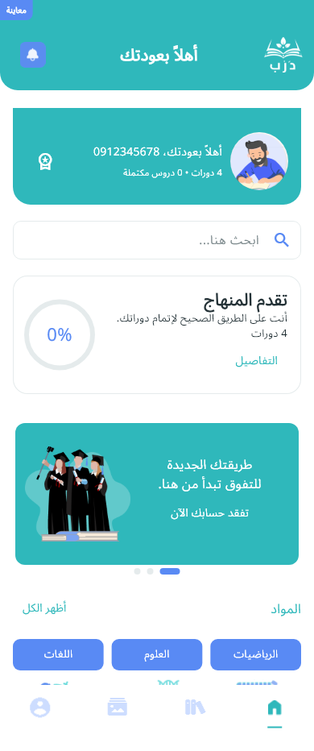
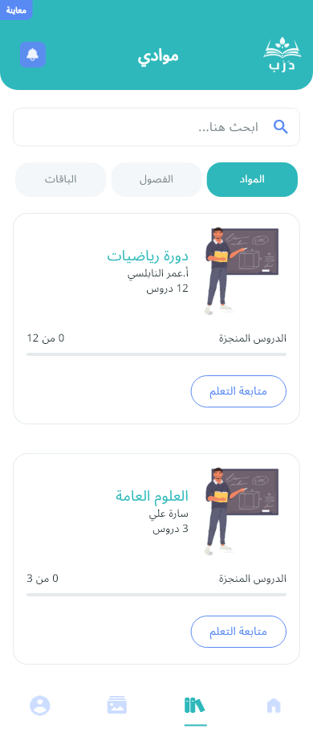
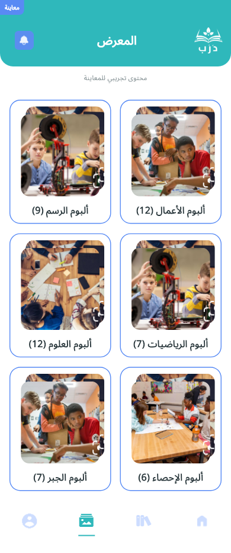

# درب — تطبيق تعليمي

**Dareb — Educational Application**

Dareb is an Arabic-first Flutter application for students to discover subjects, follow lessons, take assessments and manage their learning profile. It connects to a REST API for authentication, educational content and account operations. English, RTL/LTR layouts and persistent appearance settings are supported alongside Arabic.

## Project overview

The main journey starts with phone verification and profile completion, including school and study information. Students can then browse subjects, open chapters and lessons, submit assessment answers, review results and return to their learning history. Home, My Materials, Gallery and Profile form four persistent bottom-navigation tabs; lesson, assessment and supporting pages use separate routes.

The engineering focuses on typed API contracts, state ownership, secure session restoration, recoverable request failures and layouts that remain usable at small widths. Normal mode uses the backend. An explicitly marked development preview provides deterministic sample content for UI review.

## Features

| Area | Implemented behavior |
| --- | --- |
| Authentication and profile | Phone verification, activation, secure session persistence, school/reference-data lookup, profile completion, editing, photo upload, logout and account deletion. |
| Learning and discovery | Home banners/news, subjects/course details, search, chapter/lesson lists, attendance recording, comments and backend-provided progress/access flags. Playback depends on the video resolver. |
| Assessments and history | Typed questions/answers, multipart submission, results/review and exam/activity history. Confirmed submissions are protected against duplicate retries. Sampled activity data was empty during live QA. |
| Account information | Points, medals/cups views, achievements, notification reads and subscription/package views. Empty or unavailable server data remains visible as such. |
| Supporting content | Gallery albums with backend image grids and zoom previews, FAQ, contact information/form, About/legal pages, Arabic/English and light/dark/system preferences. Sample album images and simulated transactions are identified as preview content. |

## Technical highlights

| Technology | Role in this application |
| --- | --- |
| Flutter / Dart | Mobile UI, responsive composition and typed domain models; Dart SDK constraint `^3.10.8`. |
| BLoC / Cubit | Owns request lifecycles, validation outcomes and feature state; screens compose widgets and bind callbacks. |
| Repositories / GetIt | Separates feature capabilities from transport implementations; centralizes dependency wiring. |
| Dio / platform storage | Centralizes REST requests and safe failures; bearer credentials use `flutter_secure_storage`, preferences use `shared_preferences`. |
| GoRouter / localization | Preserves tab branches with an indexed shell; routes details independently. ARB resources drive reactive Arabic/English product copy. |

`video_player`, `image_picker` and `flutter_svg` support playback, profile photos and contextual design assets. Client capabilities do not establish successful backend transactions in every environment.

## Architecture

```text
lib/
├── application/       # Bootstrap and authenticated-session coordination
├── core/              # Config, DI, network, storage, router, theme, validation, widgets
├── features/
│   ├── auth/
│   ├── home/
│   ├── search/
│   ├── courses/
│   ├── lessons/
│   ├── assessments/
│   ├── history/
│   ├── account/
│   ├── profile/
│   ├── settings/
│   ├── achievements/
│   ├── notifications/
│   ├── subscriptions/
│   ├── gallery/
│   ├── faq/
│   ├── contact/
│   └── content/
└── l10n/              # Arabic/English resources and generated catalogs
```

Features with independent contracts own their presentation, domain and data layers. The account module intentionally shares a typed backend facade among related views rather than adding empty layers to every screen.

```text
Screen → Cubit → domain capability → repository/data adapter → REST API
```

See the [architecture guide](docs/architecture.md) for responsibility boundaries.

### Architecture decisions

1. **Feature ownership:** contracts, mappers, state and widgets stay together; home, search, lessons, assessments and history have separate request state.
2. **Session coordination:** bootstrap restores preferences and credentials before creating the router. Session changes reset the previous account's feature state.
3. **Typed boundaries:** JSON and Dio responses stay in data mapping. Shared validators normalize Arabic/Persian numerals and apply consistent input limits.
4. **Predictable requests:** generations and disposal checks prevent stale updates. Attendance and assessment retries preserve confirmed writes instead of repeating them.
5. **Shared presentation:** theme tokens and reusable components control repeated UI. `AppHeader` is the single header for the four root tabs and contains no navigation/business logic.

## Backend integration

Adapters cover authentication, profiles, school/reference data, home/search, subjects/courses, lessons/comments/attendance, exams/activities/history, account information, FAQ, content pages, galleries and contact submission. Collections map to loading, empty, error and retry states without substituting preview data in normal mode.

Registration follows the verified lifecycle:

```text
Phone → POST auth/login → verification code → POST auth/active
      → secure token → profile completion → POST users/edit
      → GET profile/get confirmation → authenticated application
```

Activation sends a device ID and includes an FCM token only when a genuine token provider is configured. Registration choices use backend IDs; changing governorate or institution type clears the previous school. Profile edits and photo uploads are confirmed by reading the updated profile.

Authenticated requests receive a bearer header from the session store. The API client restricts authenticated destinations to the configured origin/base path, applies timeouts and maps failures to safe product messages. The host is configurable; credentials and private account responses are not documented here.

## UI and adaptive layouts

The implementation follows the supplied Figma/PNG references: bundled **Noto Sans Arabic**, semantic colors, spacing/radius tokens and contextual SVG/PNG icons. The shared header retains the existing reference padding, typography, background, corners and artwork. Direction follows the locale, and bounded titles accommodate text scaling without overflowing.

Checks cover **320, 360, 390, 430, 600 and 768 logical pixels**, Arabic RTL/English LTR, safe areas and larger text. Landscape checks include **600 × 360** and **768 × 432**. Keyboard-aware authentication/registration tests verify reachable controls.

Earlier review rendered 54 UI states across six portrait widths, plus 50 landscape captures. Those development outputs are not distributed with the repository. Figma View access and raster exports did not expose every variant, token binding or adaptive constraint; exact pixel parity and universal device compatibility are not claimed.

### Screenshots

Rendered development-preview screens with sample data; these do not represent production accounts or successful payment/video services.

| Home | My Materials | Gallery |
| --- | --- | --- |
|  |  |  |

## Setup

Prerequisites: Flutter with Dart compatible with `^3.10.8`, a configured Android SDK and an emulator/device. Local validation used **Flutter 3.38.9 / Dart 3.10.8** and an Android 15 emulator. Platform runner directories are present; iOS and physical-device validation remain unverified.

1. Clone using this repository's URL from GitHub's **Code** button, then open its root directory.
2. Resolve dependencies: `flutter pub get`.
3. Configure the host if needed in your environment, using the define documented below.
4. Start the client: `flutter run`.
5. Verify and build with these commands:

```bash
flutter analyze
flutter test
flutter build apk --debug
flutter build apk --release
```

### Configuration and preview

| Setting | Purpose |
| --- | --- |
| `API_BASE_URL` | Non-secret address supplied with `--dart-define`; the default lives in [AppConfig](lib/core/config/app_config.dart). |
| Normal mode | Default in development/release; real backend and platform session storage. |
| `APP_DEMO_MODE=true` | Opt-in development preview. Disabled in product/release builds, including explicit DI overrides. |

```bash
flutter run --dart-define=API_BASE_URL=https://api.example.com/api
flutter run --dart-define=APP_DEMO_MODE=true
```

The example address is illustrative. Local preview login/verification behavior lives in `DemoAuthRepository`; preview purchases, completion and download-list changes are simulations. Never place secrets in compile-time defines for a distributable application.

After editing Arabic/English ARB resources:

```bash
dart run tool/generate_localizations.dart
```

## Testing and project quality

**Validation commands and current results are maintained in the [testing guide](docs/testing.md).**

The ordinary suite runs without live mutations. It covers API mapping/multipart fields, session restoration/expiry, account-state isolation, request races, retries, validators, tab preservation, RTL/LTR, responsive layouts and bundled assets. Sanitized fixtures retain observed response schemas while replacing backend labels and media URLs.

AppHeader checks compare all four tabs across the six widths, landscape, Arabic/English, safe areas and text scaling. They also exercise long titles and preserve the catalog header through loading/failure states, including a scrollable error body at 2× text scaling in short landscape. Fresh results and reproduction instructions are in the [testing guide](docs/testing.md).

Explicit device tests are separate from `flutter test`. Live tests require dedicated QA credentials supplied by the runner and can create or modify backend records.

## Current limitations

1. Tested video resolvers returned HTTP 500, as did one subject-detail record. End-to-end playback could not be verified in that environment.
2. Sampled notifications, achievements, subscriptions and activities were empty. Gallery currently returns one album with an empty images array; Privacy currently returns only its title. Notification mutations, payments, entitlements and actual offline downloads lack verified successful contracts; preview simulations are not production implementations.
3. Comment submission was accepted, but the subsequent list remained empty. Persistence cannot be established beyond the backend responses.
4. Android uses `com.example.tamkeen2`; release uses the existing debug signing configuration. A technical release APK is not a store-ready submission.
5. Full Figma properties, physical devices and iOS builds remain unverified. Server-owned content stays in the language returned by the API.

## Security and attribution

Bearer credentials use platform secure storage. Product errors avoid credential values; live QA tools log status/shape information rather than response bodies. Ignore rules exclude local configuration, signing material, builds and private evidence. Public fixtures use synthetic values; live verification codes come from the runner. Review credentials and signing configuration before distributing a build.

The theme centrally selects Noto Sans Arabic for Arabic and bundled Roboto for English, with the other family as a mixed-script fallback. Third-party font/icon notices remain under [assets/licenses](assets/licenses/), are registered with Flutter's license registry and are summarized in [asset attribution](docs/asset-attribution.md). Supplied artwork is project artwork; no third-party relicensing is implied. No project-wide software license has been specified.

## Author

**saad sinan** · [GitHub: SaadSinan-dev](https://github.com/SaadSinan-dev)
